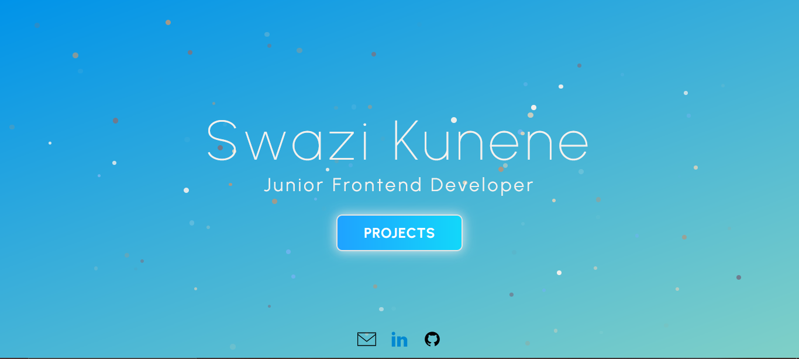
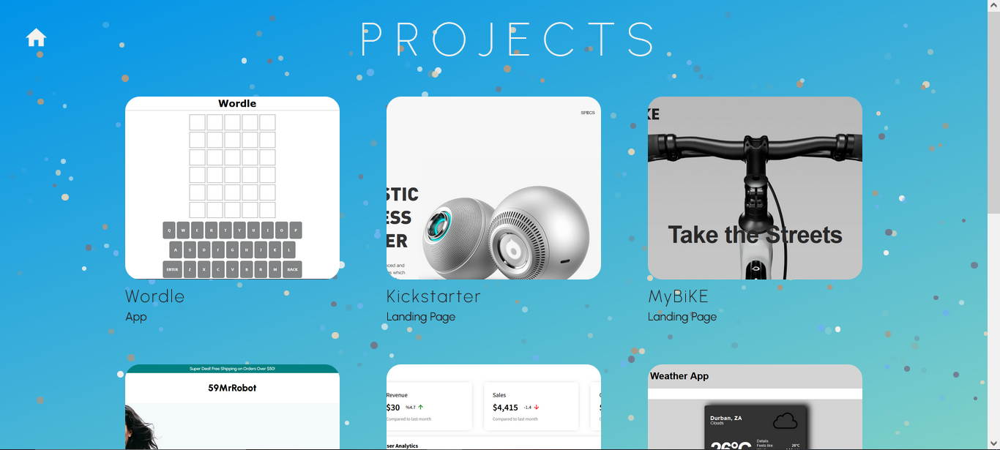
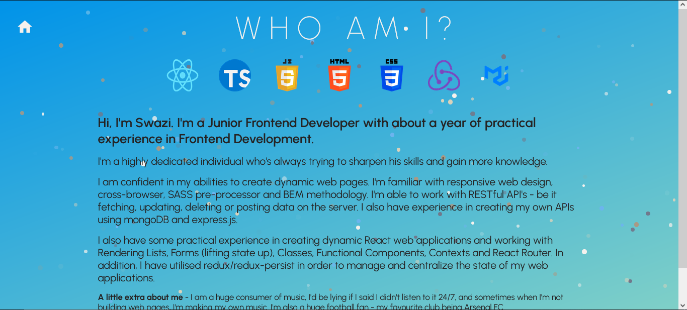

# Project Title

  Portfolio

## Demo Link:

  Access my site at https://59mrrobot.github.io/portfolio/

## About The App:

  I have built this portfolio to give potential employers a place to get to know me better. This portfolio showcases my abilities in using React, HTML, CSS, React Router and Greensock Animation Platform, it shows all the projects I've built up until this point, an about section that tells you all about me and also an opportunity to download my CV, if desired.

## Screenshots:

  
  
  

## Technologies:

  - React
  - React Router
  - TypeScript
  - HTML
  - SCSS
  - GSAP

## Setup:

- Download or clone the repository.
- Install by running `npm install`.
- Start the server by running `npm start`.
- Visit the app at `http://localhost:3000/`.
